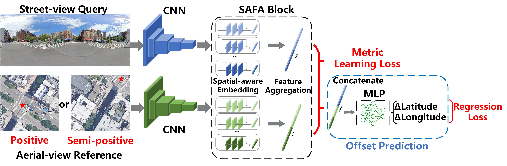
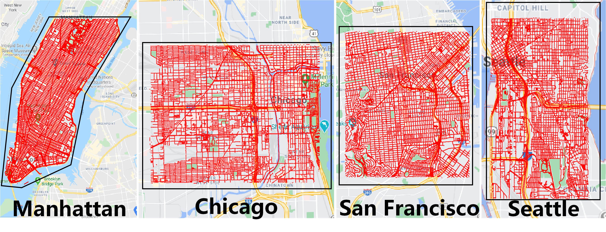

# VIGOR : Cross-View Image Geo-localization beyond One-to-one Retrieval


This repository provides the dataset and code used in "VIGOR : Cross-View Image Geo-localization beyond One-to-one Retrieval".
```bash
@inproceedings{zhu2021vigor,
  title={VIGOR: Cross-View Image Geo-localization beyond One-to-one Retrieval},
  author={Zhu, Sijie and Yang, Taojiannan and Chen, Chen},
  booktitle={Proceedings of the IEEE/CVF Conference on Computer Vision and Pattern Recognition},
  pages={3640--3649},
  year={2021}
}
```

## Dataset
Please follow the [guideline](./data/DATASET.md) to download and prepare the dataset. 


## Requirement
	- Python >= 3.5, Opencv, Numpy, Matplotlib
	- Tensorflow == 1.13.1 
	
## Evaluation from npy
Download the same-area models and npy files from the [link](https://drive.google.com/drive/folders/1Mbtuzmvv8U10bIHso2rRcdGKiSImb6rZ?usp=sharing), unzip (tar -zxvf) it in "./data/". Then run the script:

    python evaluate_from_npy.py
    
## Training and evaluating from model
Download the initialization [weights](https://drive.google.com/file/d/1nAHPTq1lbbrseK4uFVgbvM4iL2BazrZ3/view?usp=sharing) from ImageNet, put it in "./data/". Then run the script to train a simple SAFA baseline:

    python train_SAFA.py
    
Run the script to train with our method:

    python train_overall.py
    
## Reference
    - https://github.com/shiyujiao/cross_view_localization_SAFA
	- https://github.com/Jeff-Zilence/Explain_Metric_Learning
	- https://github.com/david-husx/crossview_localisation.git
