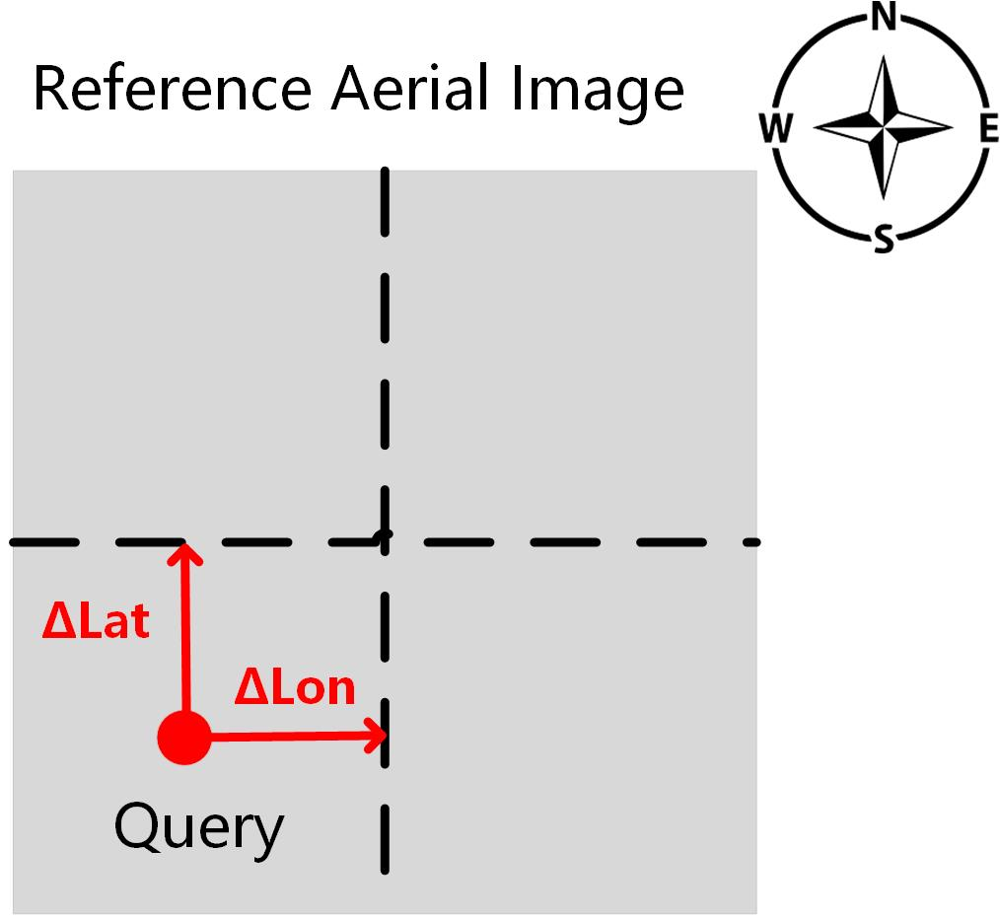

# Dataset
Please fill out the [questionnaire](https://docs.google.com/forms/d/e/1FAIpQLScTSD6AFZgre3yLNbl7OqBcjrJF0-u2cpwgubqSQnyVzPKJzA/viewform?usp=sf_link) to get the dataset. This dataset is ONLY permitted for academic research. Do NOT distribute. If you have trouble downloading the dataset, contact me via email (szhu3@uncc.edu) .

You may unzip (tar -zxvf) the data and modify the root path in dataloader.py (or simply put them in ./data/VIGOR) . The data should be organized as:
```bash
VIGOR
|_ Chicago
| |_ panorama
|    |_ [prefix,latitude,longitude,].jpg
|    |_ ...
| |_ satellite
|    |_ [satelitte_latitude_longitude].jpg
|    |_ ...
|_ NewYork
| |_ panorama
|    |_ [prefix,latitude,longitude,].jpg
|    |_ ...
| |_ satellite
|    |_ [satelitte_latitude_longitude].jpg
|    |_ ...
|_ SanFrancisco
| |_ panorama
|    |_ [prefix,latitude,longitude,].jpg
|    |_ ...
| |_ satellite
|    |_ [satelitte_latitude_longitude].jpg
|    |_ ...
|_ Seattle
| |_ panorama
|    |_ [prefix,latitude,longitude,].jpg
|    |_ ...
| |_ satellite
|    |_ [satelitte_latitude_longitude].jpg
|    |_ ...
|_ splits

```

Since the raw GPS is provided in the file name of each image, you may generate label by you own. You can also simply use our label in the splits.zip .

In the pano_label_balanced.txt, we provide the positive and semi-positive reference names for each panorama. The first one is positive and the following three samples are semi-positive. We first compute the GPS offset of each reference relative to the panorama, then the GPS offset is converted into pixel numbers for convenience. Details about converting GPS offset to pixel offset (delta) is included in evaluate_from_npy.py . The orientation is shown in the figure:

